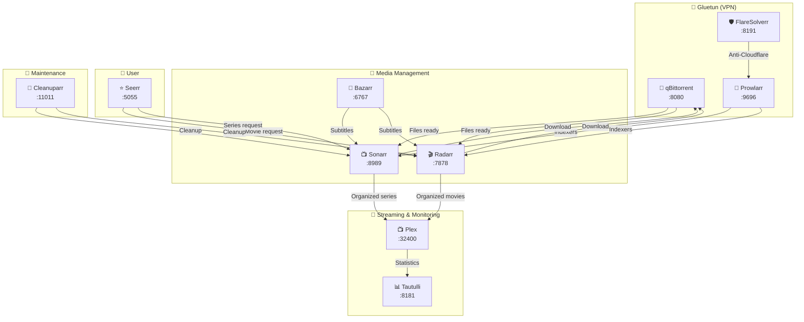

# 🔗 Mermaid Diagram — Multimedia Hub Workflow

This diagram can replace the current image in the main README.  
GitHub natively renders Mermaid blocks in Markdown files.

---



---

## 📌 How to Integrate into the Main README

Replace the current image block:

```markdown

```

With the Mermaid block above (copy the content between the ` ```mermaid ` and ` ``` ` tags).
