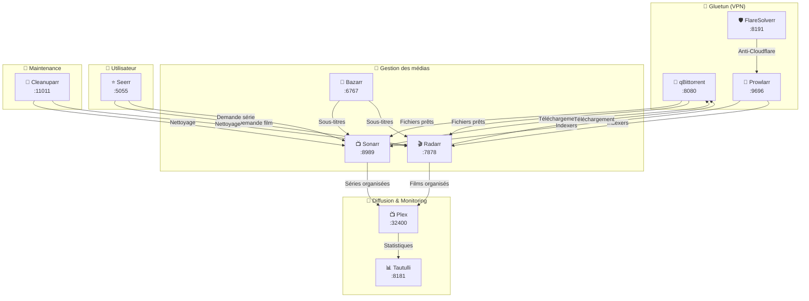

# 🔗 Diagramme Mermaid — Flux de fonctionnement du Hub Multimédia

Ce diagramme peut remplacer l'image actuelle dans le README principal.  
GitHub rend nativement les blocs Mermaid dans les fichiers Markdown.

---



---

## 📌 Comment intégrer dans le README principal

Remplacer le bloc image actuel :

```markdown

```

Par le bloc Mermaid ci-dessus (copier le contenu entre les balises ` ```mermaid ` et ` ``` `).
